# Git

## 版本管理

把编码过程中的每一步记录下来

后续如果出现了问题，只要记录了，就可以找回  （玩游戏存档）

## 常见版本管理软件

1. **git**分布式版本控制系统，没有中央服务器，每个人的电脑是一个完整的版本库，这样，工作的时候可不需要联网，因为版本都在自己电脑上，即每个人的电脑都有一个完整的版本库，那么如何实现多人协作呢？比如自己在电脑上修改了文件A，别人也修改了文件A，此时，需要把两人之间各自所做的修改推送给对方，就可以互相看到对方所做的修改了。

2. svn：集中式版本控制系统，版本库是集中放在中央服务器，工作的时候用的都是自己的电脑，所以开始工作之前需要从中央服务器那里获取最新的版本，然后开始工作，工作完后，需要把自己所做的工作推送到中央服务器。集中式版本控制系统必须要联网才能工作，如果在局域网中，有足够的宽带，运行速度够快，而在互联网环境下，网速慢通常会导致服务难以进行。

## 安装

官网地址：https://git-scm.com/downloads

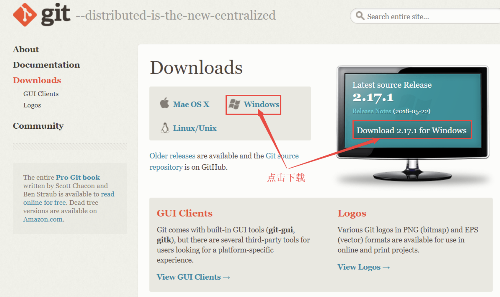

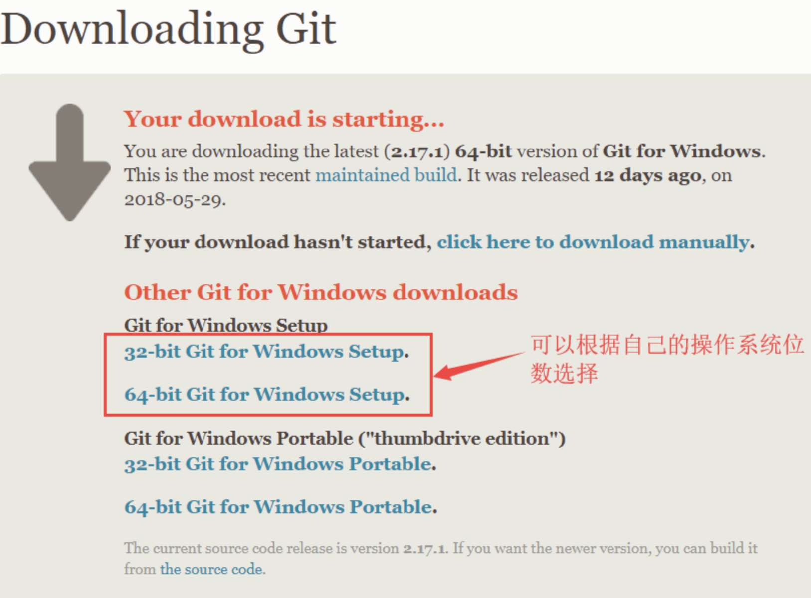

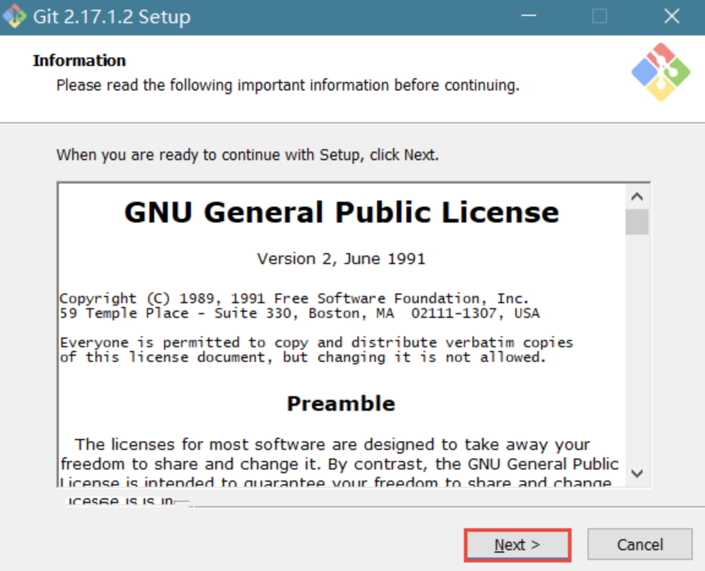

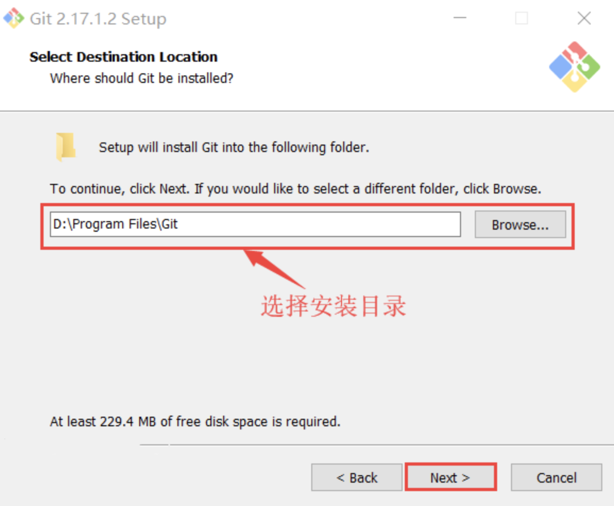

选择好安装路径后，点击“Next”进入下一步，弹出安装配置窗口，包括git命令行、git图形窗口等

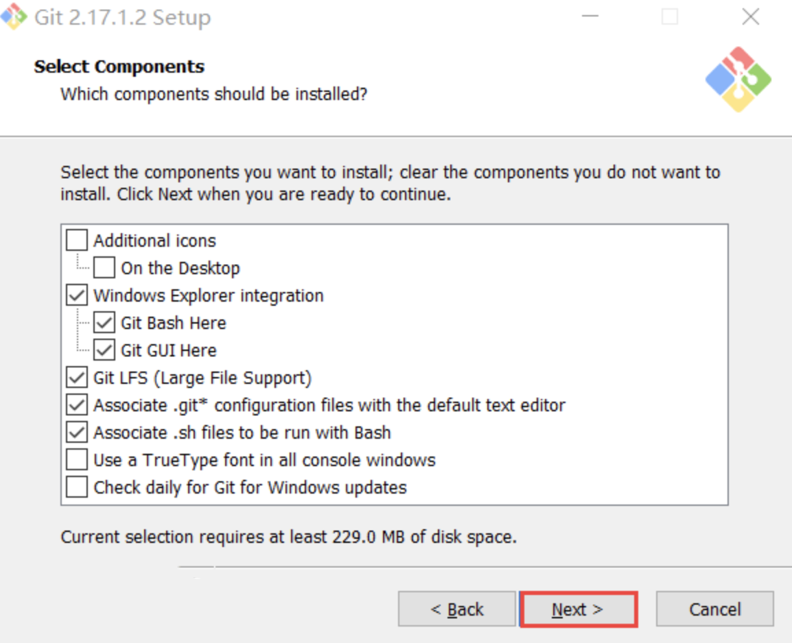

Additional icons 附加图标
	On the Desktop 在桌面上
Windows Explorer integration  Windows资源管理器集成鼠标右键菜单
	Git Bash Here
	Git GUI Here
Git LFS (Large File Support)  大文件支持
Associate .git* configuration files with the default text editor  将 .git 配置文件与默认文本编辑器相关联
Associate .sh files to be run with Bash  将.sh文件关联到Bash运行
Use a TrueType font in all console windows  在所有控制台窗口中使用TrueType字体
Check daily for Git for Windows updates  每天检查Git是否有Windows更新

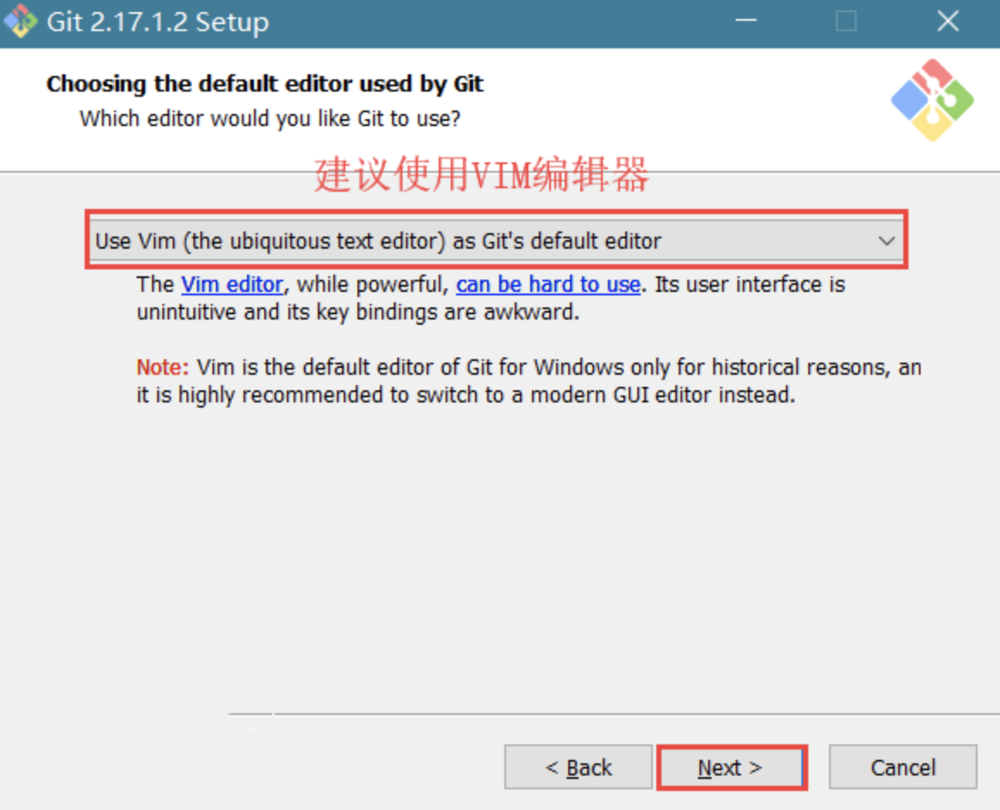
Use the Nano editor by default  默认使用 Nano 编辑器
Use Vim (The ubiquitous text editor) as Git's default editor  使用 Vim 作为 Git 的默认编辑器
Use Notepad++ as Git's default editor  使用 Notepad++ 作为 Git 的默认编辑器
Use Visual Studio Code as Git's default editor  使用 Visual Studio Code 作为Git 的默认编辑器
Use Visual Studio Code Insiders as Git's default editor  使用Visual Studio Code Insiders 作为 Git 的默认编辑器

调整Path环境变量

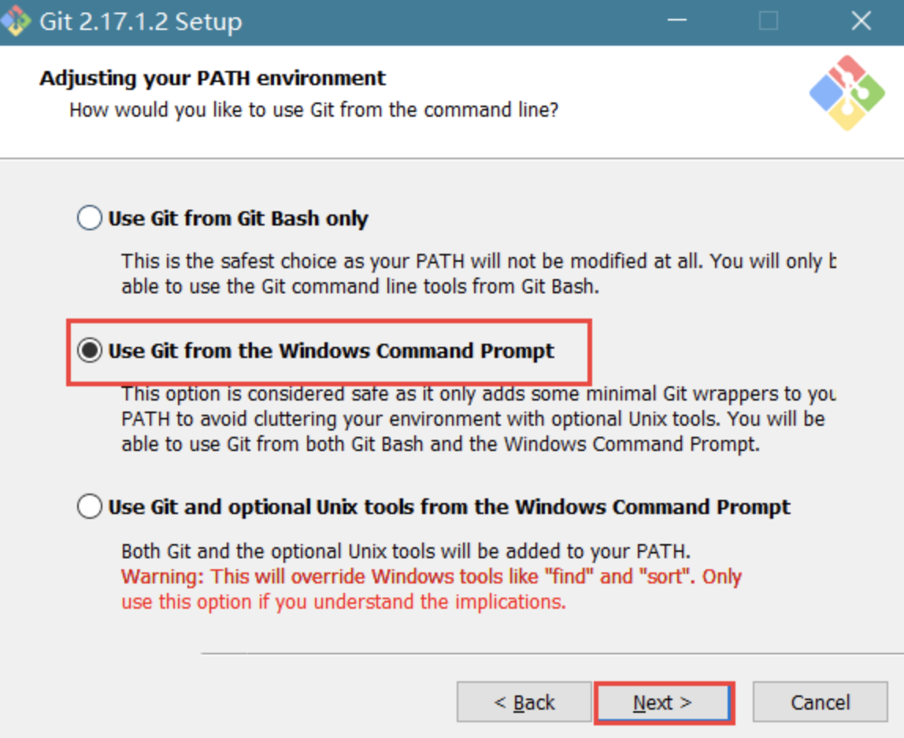

配置PATH环境
Use Git from Git Bash only
This is the safest choice as your PATH will not be modified at all.You will only be able to use the Git command line tools form Git Bash.
这是最安全的选择，因为您的PATH根本不会被修改。您只能使用 Git Bash 的 Git 命令行工具。

Use Git from the Windows Command Prompt
This option is considered safe as it only adds some minimal Git wrappers to your PATH to avoid cluttering your environment with optional Unix tools . You will be able to use Git from both Git Bash and the Windows Command Prompt.
这个选项被认为是安全的，因为它只向PATH添加一些最小的 Git包，以避免使用可选的Unix工具混淆环境。 您将能够从 Git Bash 和 Windows 命令提示符中使用 Git。

Use Git and optional Unix tools from the Windows Command Prompt
从Windows命令提示符使用Git和可选的Unix工具
Both Git and the optional Unix tools will be added to you PATH
Git和可选的Unix工具都将添加到您计算机的 PATH 中
Warning:This will override Windows tools like "find and sort".Only use this option if you understand the implications.
警告：这将覆盖Windows工具，如 “ find 和 sort ”。只有在了解其含义后才使用此选项。

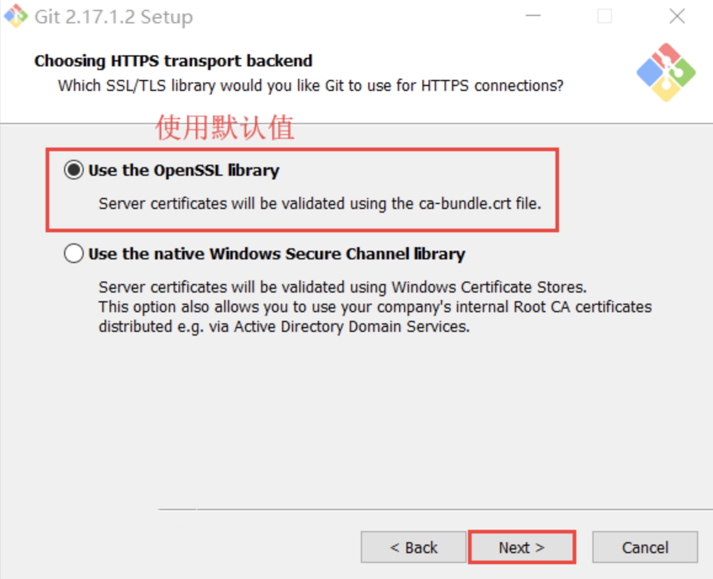

Use the OpenSSL library
使用 OpenSSL 库
Server certificates will be validated using the ca-bundle.crt file.
服务器证书将使用ca-bundle.crt文件进行验证。

Use the native Windows Secure Channel library
使用本地 Windows 安全通道库
Server certificates will be validated using Windows Certificate Stores.This option also allows you to use your company's internal Root CA certificates distributed e.g. via Active Directory Domain Services.
服务器证书将使用Windows证书存储验证。此选项还允许您使用公司的内部根CA证书，例如， 通过Active Directory Domain Services 。

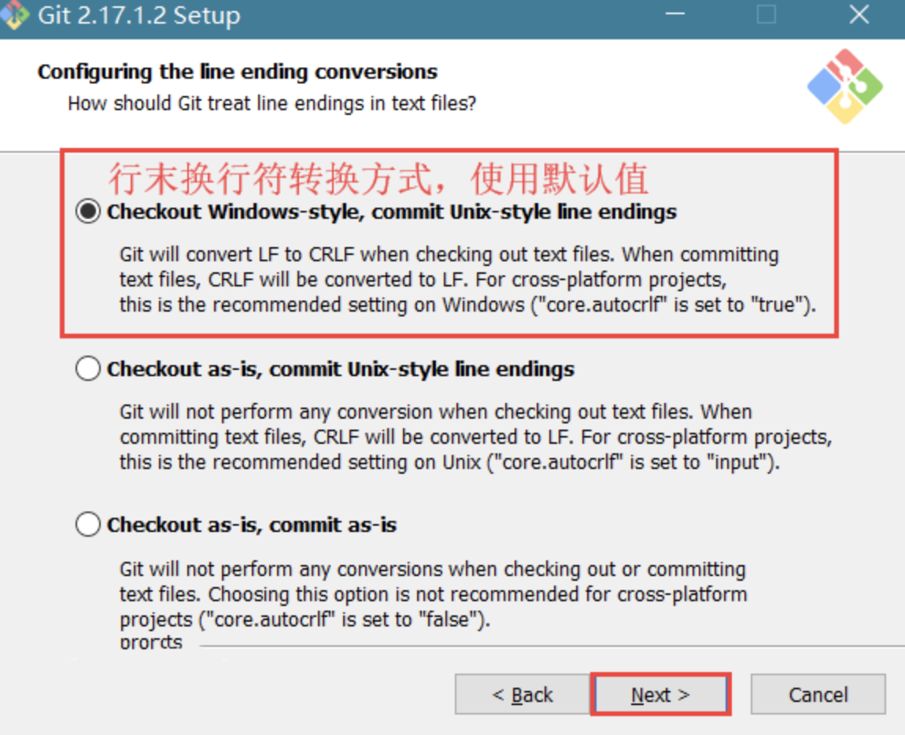

Checkout Windows-style,commit Unix-style line endings
Git will convert LF to CRLF when checking out text files.When committing text files,CRLF will be converted to LF .For cross-pltform projects,this is the recommended setting on Windows ("core.autocrlf" is set to "true")
在检出文本文件时，Git会将LF转换为CRLF。当提交文本文件时，CRLF将转换为LF。 对于跨平台项目，这是Windows上推荐的设置（“core.autocrlf”设置为“true”）

Checkout as-is , commit Unix-style line endings
Git will not perform any conversion when checking out text files. When committing text files, CRLF will be converted to LF. For cross-platform projects,this is the recommended setting on Unix ("core.autocrlf" is set to "input")
在检出文本文件时，Git不会执行任何转换。 提交文本文件时，CRLF将转换为LF。 对于跨平台项目，这是Unix上的推荐设置 （“core.autocrlf”设置为“input”）

Checkout as-is,commit as-is
Git will not perform any conversions when checking out or committing text files.Choosing this option is not recommended for cross-platform projects ("core.autocrlf"is set to "false")
在检出或提交文本文件时，Git不会执行任何转换。对于跨平台项目，不推荐使用此选项（“core.autocrlf”设置为“false”）

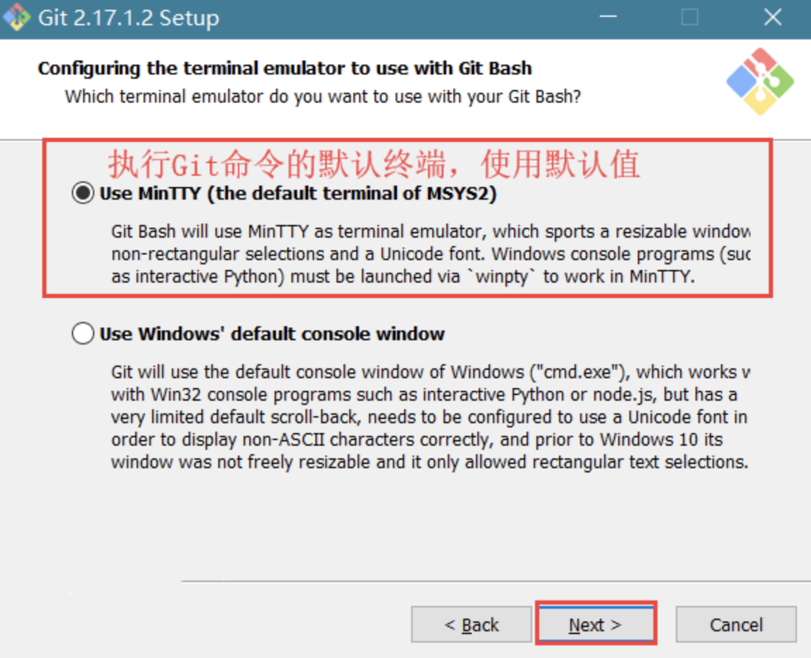

Use MinTTY (the default terminal of MSYS2)
Git Bash will use MinTTY as terminal emulator,which sports a resizable window,non-rectangular selections and a Unicode font. Windows console programs (such as interactive Python) must be launched via 'winpty' to work in MinTTY.
Git Bash将使用MinTTY作为终端模拟器，该模拟器具有可调整大小的窗口，非矩形选区和Unicode字体。 Windows控制台程序（如交互式Python）必须通过'winpty'启动才能在MinTTY中运行。

Use Windows' default console window
Git will use the default console window of Windows ("cmd.exe"),which works well with Win32 console programs such as interactive Python or node.js , but has a very limited default scroll-back,needs to be configured to use aUnicode font in order to display non-ASCII characters correctly,and prior to Windows 10 its windows was not freely resizable and it only allowed rectangular text selections.
Git将使用Windows的默认控制台窗口（“cmd.exe”），该窗口可以与Win32控制台程序（如交互式Python或node.js）一起使用，但默认的回滚非常有限，需要配置为使用unicode 字体以正确显示非ASCII字符，并且在Windows 10之前，其窗口不能自由调整大小，并且只允许矩形文本选择。

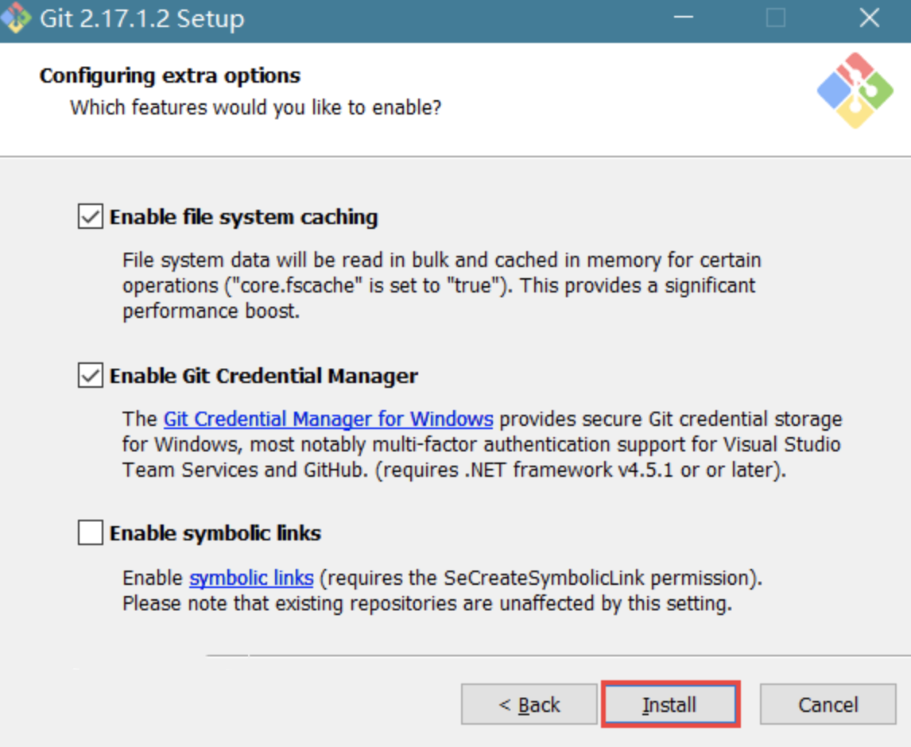

Enable file system caching
启用文件系统缓存
File system data will be read in bulk and cached in memory for certain operations ("core.fscache" is set to "true"). This provides a significant performance boost.
文件系统数据将被批量读取并缓存在内存中用于某些操作（“core.fscache”设置为“true”）。 这提供了显着的性能提升。

Enable Git Credential Manager
启用Git凭证管理器
The Git Credential Manager for Windows provides secure Git credential storage for Windows,most notably multi-factor authentication support for Visual Studio Team Services and GitHub. (requires .NET framework v4.5.1 or or later).
Windows的Git凭证管理器为Windows提供安全的Git凭证存储，最显着的是对Visual Studio Team Services和GitHub的多因素身份验证支持。 （需要.NET Framework v4.5.1或更高版本）。

Enable symbolic links
启用符号链接
Enable symbolic links (requires the SeCreateSymbolicLink permission).Please note that existing repositories are unaffected by this setting.
启用符号链接（需要SeCreateSymbolicLink权限）。请注意，现有存储库不受此设置的影响。

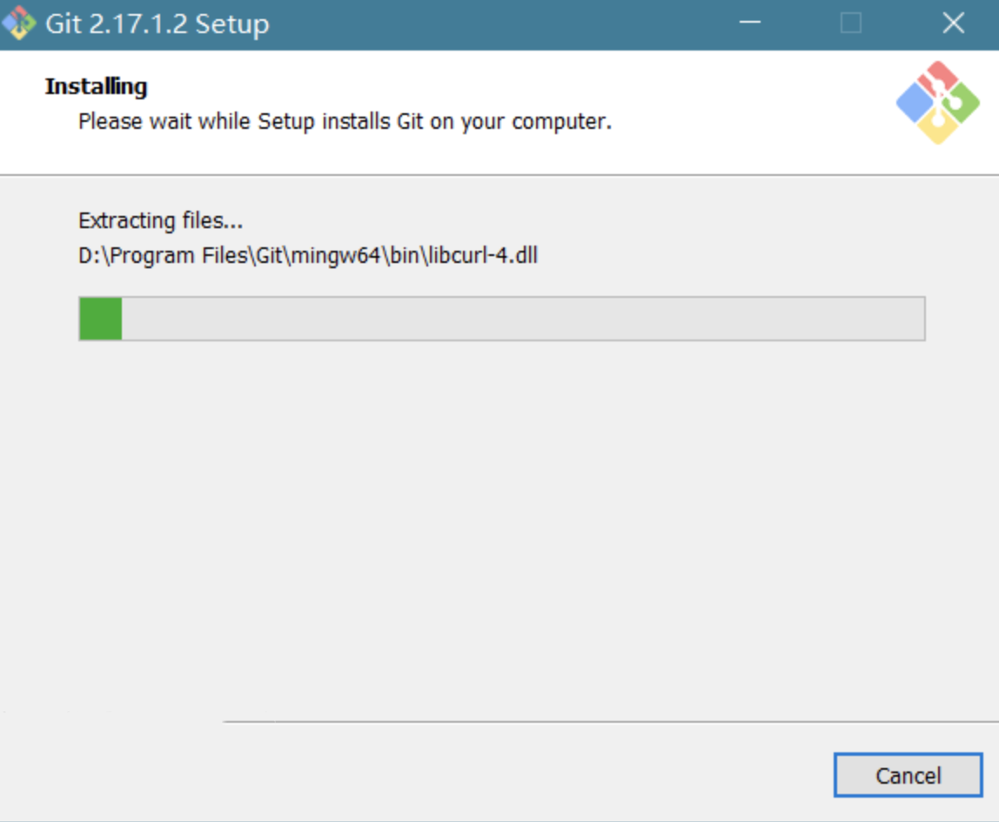

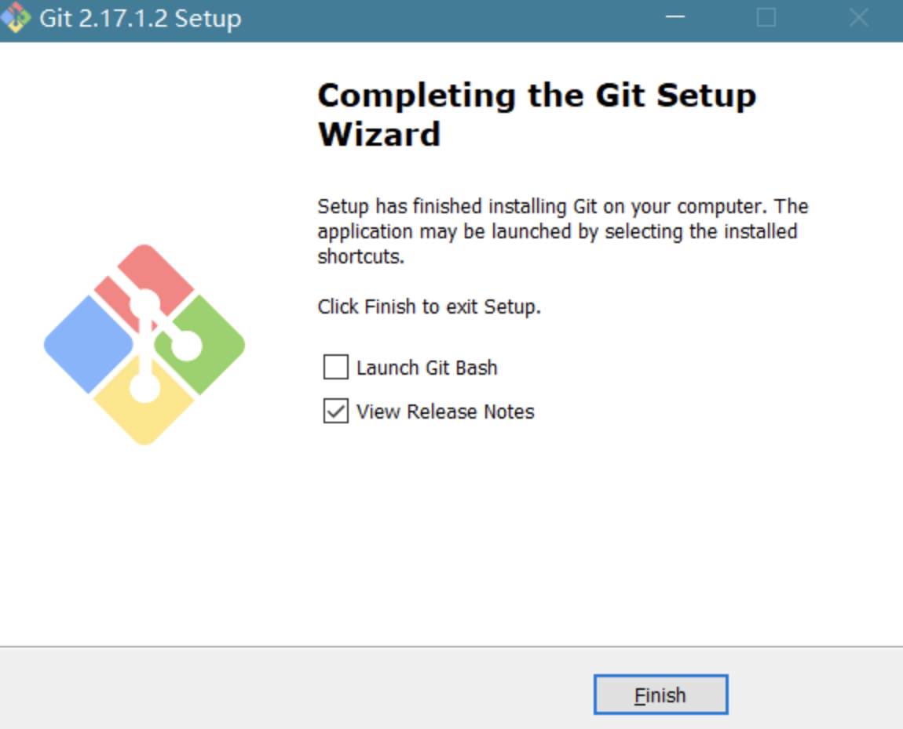

## git使用步骤

### 基本使用步骤

mkdir learngit 		//创建一个名叫learngit的空目录

$ cd learngit 			//把learngit设置为当前目录

1. 新建初始化仓库 git init 
2. 记录信息 
   1. git add 文件名														添加到暂存区(git add readme.txt)
   2. git commit -m "记录的内容"								 告诉git把这个文件提交到仓库,-m后面输入的是本次提交的说明，可以输入任意内容。
   3. 第一次会有一个错误提示(如果注册了github,推荐用github的邮箱和用户名)
   4. git config --global user.email "you@example.com"
        git config --global user.name "Your Name"
3. 查看记录的信息 git log 
4. 通过git status来查看是否还有其他文件没有提交（nothing to commit）

### 常见问题

1. 命令输入的时候 有回车
   1. git add . 							 add和.之间有空格
   
      （1）.git add all无论在哪个目录执行都会提交相应文件。
   
      （2）git add .只能够提交当前目录或者它后代目录下相应文件。
   
   2. git commit -m"信息" 		commit 和-m之间有空格
2. 仓库的位置
   1. 新建文件夹
   2. 进入文件夹
   3. 右键 git bash here
   4. git init
3. 编码的位置
  
   1. 跟执行 git init 命令相同的目录下
4. 如何在git bash 打开的窗口中复制粘贴
5. 设置用户名和密码一次设置就行，设置成功之后无需在设置

## git版本穿梭

1. 查看版本信息
   1. git log 
      1. 查看完整信息 比较多
      2. 可能会出现无法退出的情况  输入q即可
   2. git log --oneline
      1. 查看简略版本的信息
2. 版本穿梭
   1. git reset --hard 版本号

## 本地git工作流程

```
  git init 
  git config --global user.email ""
  git config --global user.name ""
  while(true){
    修改代码
    git add .
    git commit -m"信息"
  }
```

## 修改用户名和邮箱

不用删除直接重新设置即可覆盖

```
git config --global user.email "you@example.com"

git config --global user.name "Your Name"
```


## github

### 远程仓库

另外一台电脑上有一个跟本地相同的 .git文件夹

多个地方都保存了同一个副本（仓库）

常见免费的远程仓库

1. github
2. gitlab
3. 码云
4. 公司内部的仓库
5. ..

### github 是什么

**免费的远程仓库**，这个网站作用为开发人员提供免费的git远程仓库，让你把代码存起来

**全世界最大的开源软件平台**，很多流行的框架，项目会在github上公开，谁都可以看，学习

”全世界最大的同性交友平台“


### 使用步骤

#### 新建远程仓库


#### 克隆到本地 

打开小黑窗

git clone 远程仓库地址

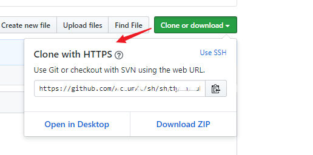


#### 易错点

输入用户名和密码

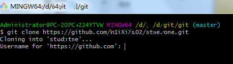

输入用户名看的到，输入密码是看不到的

#### 本地编码 （最为频繁的操作）

1. 写东西
2. git add .
3. git commit -m "信息”

#### 提交到远程

git push 

把本地的推送到远程

一般不会那么频繁

建议 1天 1到2次即可


#### 用户名和邮箱设置建议

当你用了github之后 建议把你本地的git 设置的用户名和邮箱改为和github一致

github查看提交人的时候可以匹配到对应的github账号，更方便别人找到你

git config --global user.email "github邮箱"

git config --global user.name "github用户名"

## git辅助工具

简化git的操作，让开发人员专注于编码

1. tortoisegit
2. sourceTree
3. githubDesktop
4. *vscode*s

## github设置个人主页

1. 新建仓库

   你的用户名.github.io

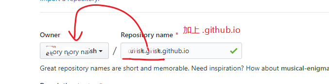

1. 克隆到本地
2. 编码 add commit 
3. 推送即可


   

​    


